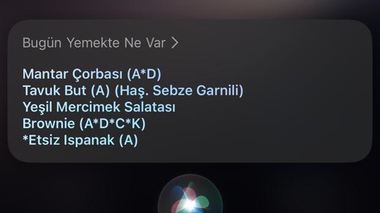
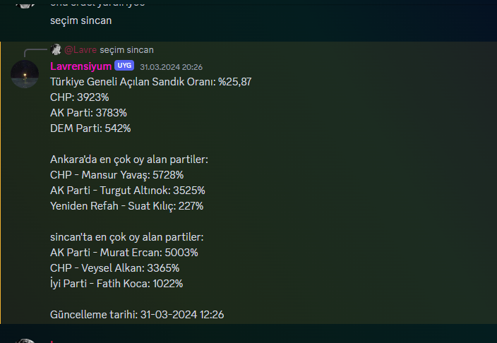
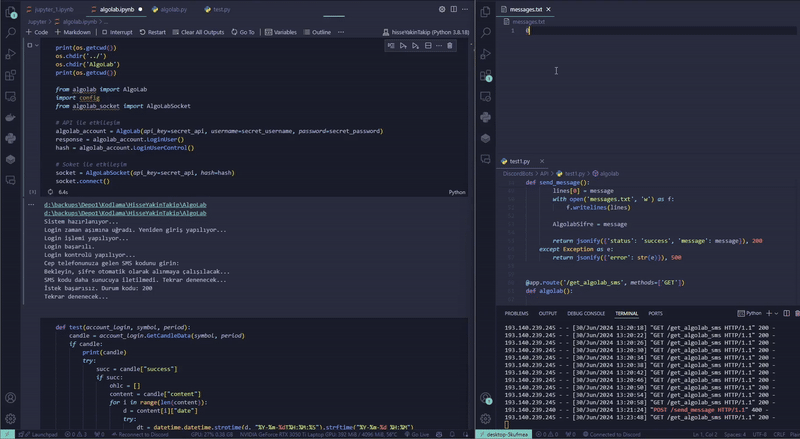
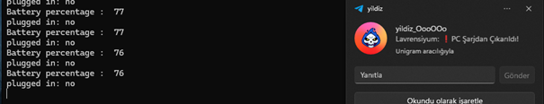
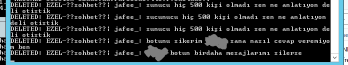

# big.LITTLE.programs

The archive I created for every "what if" ideas.


## HacettepeYemekBot

Deployable server script to get request with Siri (Apple) to get todays meal.



```
Hey Siri!
what. we. will. eat. today.
```
Who would be interested in opening the sksdb.hacettepe website? Neither do i..


## LockScreenWallpaperEngine


```
That's all well and good, but doesn't that WallpaperEngine work on the Windows lock screen?
```
It will work now.

## RAMLooker

Receive a message from telegram when the server's ram capacity exceeds xGB.

Thanks to this, I changed hosts to another provider.


## SecimBot



Turkey's presidential election follow-up is now on Discord! No need to watch TV.

## SMS_Fetcher



A pipline that retrieves AlgoLab password from an SMS and sends to HisseYakinTakip bot.

## ThiefProtect

What you left behind is in good hands! If someone unplug charger from your PC, you will get a notification in Telegram.



## SUSTURULDUN

Put the ban (mute) hammer in the hand of your defenseless son (Discord bot) (BAN FESTIVAL)

