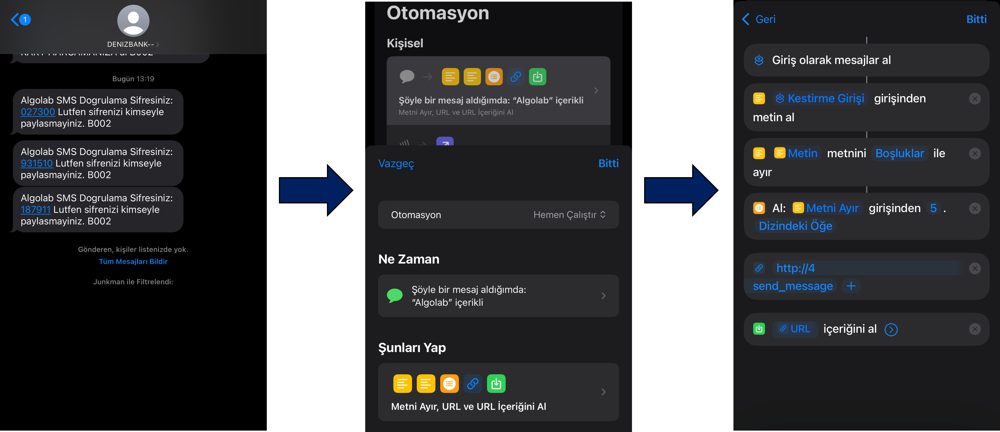

# SMS_Fetcher

This pipeline retrieves the AlgoLab account password from an SMS and sends it to my Flask server.

The primary goal is to obtain the password from the AlgoLab SMS and run the HisseTakipBot automatically.

## How does it work?
- Wait for the SMS to arrive iOS device.
- iOS Shortcuts App will catch the SMS and extract the password (5-digit number). Send to the my Flask server.
- The Flask server catch the password and save to the `messages.txt` file.
- If HisseTakipBot is requested, Flask server send to last password to the HisseTakipBot and delete from the `messages.txt` file.

## iOS Shortcuts steps



```js
Method: POST
Request Body: JSON
```

## Live Demo


> Left: HisseTakipBot sandbox mode.
>
> Right: SMS_Fetcher running Flask Server on the my private server.

## Conclusion:

The bot now automates logging into the AlgoLab system when it closes at the BIST close shift and reopens in the morning shift. There's no need to send the SMS password remotely anymore. The bot can access the login password automatically, eliminating the need for operator intervention.

## License

MIT License

Copyright (c) [2024] [github.com/lavrensiyum]

Permission is hereby granted, free of charge, to any person obtaining a copy
of this software and associated documentation files (the "Software"), to deal
in the Software without restriction, including without limitation the rights
to use, copy, modify, merge, publish, distribute, sublicense, and/or sell
copies of the Software, and to permit persons to whom the Software is
furnished to do so, subject to the following conditions:

The above copyright notice and this permission notice shall be included in all
copies or substantial portions of the Software.

THE SOFTWARE IS PROVIDED "AS IS", WITHOUT WARRANTY OF ANY KIND, EXPRESS OR
IMPLIED, INCLUDING BUT NOT LIMITED TO THE WARRANTIES OF MERCHANTABILITY,
FITNESS FOR A PARTICULAR PURPOSE AND NONINFRINGEMENT. IN NO EVENT SHALL THE
AUTHORS OR COPYRIGHT HOLDERS BE LIABLE FOR ANY CLAIM, DAMAGES OR OTHER
LIABILITY, WHETHER IN AN ACTION OF CONTRACT, TORT OR OTHERWISE, ARISING FROM,
OUT OF OR IN CONNECTION WITH THE SOFTWARE OR THE USE OR OTHER DEALINGS IN THE
SOFTWARE.